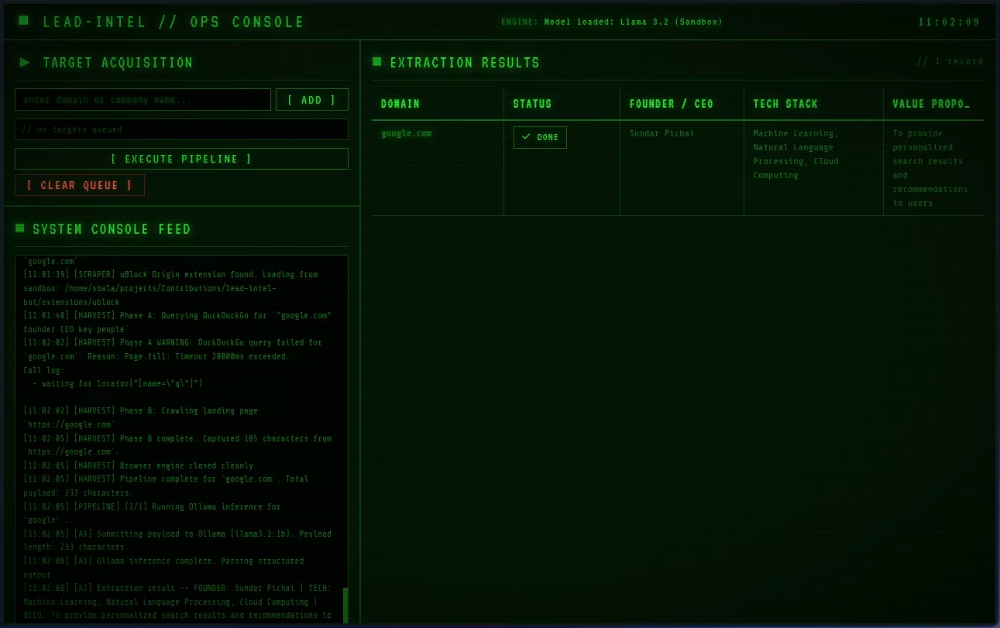
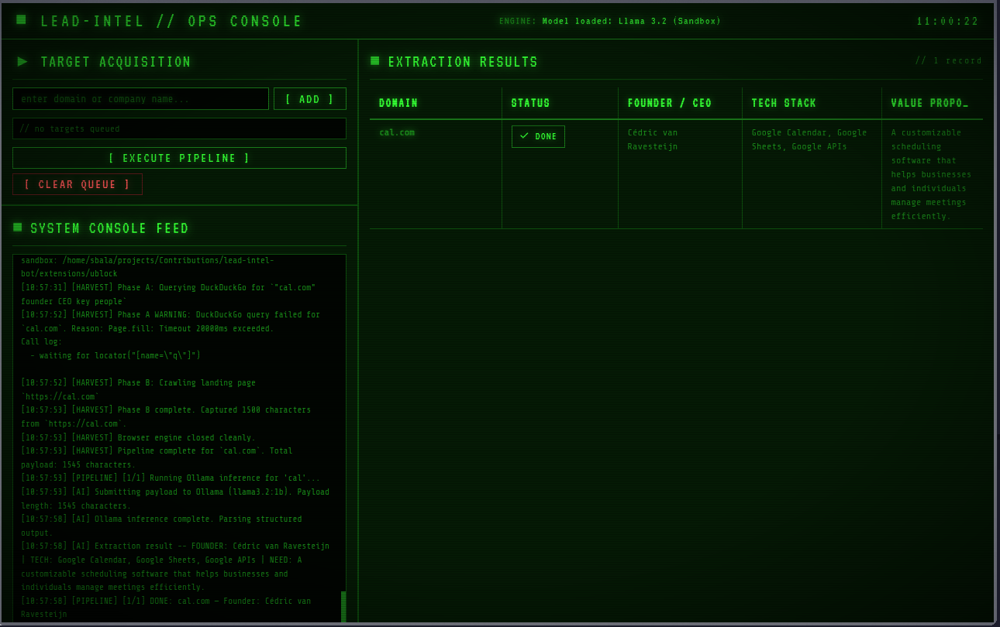

# LEAD INTEL SYSTEM

> **Automated company intelligence extraction — powered by local AI, zero cloud dependency.**

-33ff33?style=flat-square&logo=python&logoColor=black&labelColor=051a05&color=33ff33)


---

<p align="center">
  
</p>

<p align="center">
  
</p>

---

## What is this?

**Lead Intel System** is a fully offline, privacy-first desktop tool that automates competitor and lead research. You give it a list of company names or domains. It spins up a sandboxed headless browser, scrapes public web data, and feeds the raw text to a locally running AI model that extracts three structured intelligence fields per target:

| Field | What it extracts |
|---|---|
| **Founder / CEO** | Full name of the company's founder or chief executive |
| **Tech Stack** | Top 3 technologies or frameworks the company uses |
| **Value Proposition** | One sentence: the core problem the business solves |

Everything runs **on your machine**. No API keys. No data leaves your network. No subscriptions.

---

## Demo

<p align="center">
  <a href="assets/ss.mp4">
    
    <br/>
    <strong>▶ Watch the full demo (assets/ss.mp4)</strong>
  </a>
</p>

> The video above shows a live run against `cal.com` — the system scrapes, extracts, and presents structured intelligence in under 90 seconds with no internet-facing services involved.

---

## How It Works — Plain English

```
You type a domain → App opens a hidden browser → Searches DuckDuckGo → Visits the company website
→ Grabs all visible text → Sends it to a local AI model → AI extracts Founder, Tech, and Need
→ Results appear on the dashboard → Auto-saved to a CSV report
```

The entire pipeline runs concurrently in the background. The dashboard polls for updates every 1.5 seconds and shows live status badges (`QUEUED → SCANNING → AI-EXTRACTING → DONE`) so you always know where each target is in the pipeline.

---

## Architecture

```
lead-intel-bot/
├── app.py                   # Master entrypoint — boots all threads, opens native window
├── core/
│   ├── config.py            # Path sandboxing, env variables, PyInstaller compatibility
│   ├── state.py             # Thread-safe global state (GIL-free safe, explicit locks)
│   ├── preflight.py         # Boot checks: Ollama health, model pull, Chromium install
│   ├── scraper.py           # Async Playwright scraper — DuckDuckGo + direct page crawl
│   ├── ai.py                # Ollama HTTP client + structured response parser
│   ├── server.py            # Flask REST API (/, /status, /run, /export/csv)
│   └── ui_template.py       # Self-contained CRT terminal dashboard (HTML/CSS/JS)
├── data/
│   ├── ms-playwright/       # Sandboxed Chromium binaries (never written to OS dirs)
│   ├── ollama/models/       # Sandboxed LLM weights
│   └── reports/             # Auto-generated timestamped CSV reports
├── extensions/
│   └── ublock/              # Packaged uBlock Origin — loaded into every browser session
├── assets/
│   ├── ss.mp4               # Demo video
│   ├── ss01.png             # Dashboard screenshot
│   └── ss02.png             # Results screenshot
├── pyproject.toml
└── requirements.txt
```

### Thread Architecture

The application runs three concurrent OS threads on a GIL-free Python 3.14t runtime:

```
Main Thread          → pywebview GUI loop (owns the process lifetime)
preflight-worker     → Ollama checks, model download, Chromium install (daemon)
flask-server         → REST API at 127.0.0.1:1995 (daemon)
pipeline-worker      → Spawned on demand: scrape + AI loop per execution run (daemon)
```

All shared state is protected by an explicit `threading.Lock()` — required because Python 3.14t runs with the GIL disabled, meaning standard `dict` and `list` mutations are not thread-safe without it.

---

## Requirements

### System Requirements

| Requirement | Minimum |
|---|---|
| OS | Linux, macOS 12+, or Windows 10/11 |
| RAM | 4 GB (8 GB recommended for smooth AI inference) |
| Disk | ~2 GB free (Chromium ~130 MB + Llama 3.2 1B ~1.3 GB) |
| Python | 3.11+ (3.14t recommended for GIL-free performance) |
| Network | Required on first run only (to download model + Chromium) |

### External Dependencies

| Tool | Purpose | Auto-installed? |
|---|---|---|
| **Ollama** | Runs the local Llama 3.2 AI model | ❌ Manual (see below) |
| **Chromium** | Headless browser for scraping | ✅ Auto on first run |
| **Llama 3.2 1B** | AI extraction model | ✅ Auto on first run |

---

## Installation

### Step 1 — Install Ollama

Ollama is the local AI runtime. Install it from the official site:

```bash
# Linux / macOS
curl -fsSL https://ollama.com/install.sh | sh

# Windows
# Download the installer from: https://ollama.com/download
```

After installing, verify it is running:

```bash
ollama --version
```

You do **not** need to manually pull any model — the application handles that automatically on first launch.

---

### Step 2 — Clone the Repository

```bash
git clone https://github.com/soumyajit-bala/lead-intel-bot.git
cd lead-intel-bot
```

---

### Step 3 — Create a Virtual Environment

```bash
# Create the environment
python3 -m venv .venv

# Activate it
# Linux / macOS:
source .venv/bin/activate

# Windows (PowerShell):
.venv\Scripts\Activate.ps1
```

---

### Step 4 — Install Python Dependencies

```bash
pip install -r requirements.txt
```

---

### Step 5 — Run the Application

```bash
python app.py
```

The native desktop window will open. On **first launch**, the system will:

1. Check that Ollama is reachable
2. Pull the `llama3.2:1b` model (~1.3 GB — one-time download)
3. Install sandboxed Chromium binaries into `data/ms-playwright/`

Watch the **System Console Feed** in the bottom-left panel for real-time progress. The `[ EXECUTE PIPELINE ]` button becomes active once setup is complete.

> **First launch takes 2–5 minutes** depending on your internet speed. All subsequent launches start in under 3 seconds.

---

## Using the Dashboard

<p align="center">
  
</p>

### 1. Add Targets

Type a company name or domain into the **Target Acquisition** input box and press `[ ADD ]` or hit `Enter`.

```
Examples:
  cal.com
  stripe.com
  notion
  openai
```

Bare names without a `.` are automatically treated as `.com` domains.

### 2. Execute the Pipeline

Click `[ EXECUTE PIPELINE ]` to start scanning all queued targets.

Each target moves through the following status stages:

| Badge | Meaning |
|---|---|
| `QUEUED` | Waiting to be processed |
| `SCANNING` | Browser is live — scraping DuckDuckGo and the company page |
| `AI-EXTRACT` | Ollama is running inference on the scraped text |
| `✓ DONE` | Extraction complete — data visible in the table |
| `⚠ ERROR` | Scraping returned no usable text — target skipped |

### 3. Read the Results

Results appear live in the **Extraction Results** table on the right. Columns:

- **Domain** — The target company URL
- **Status** — Current pipeline stage
- **Founder / CEO** — Extracted executive name
- **Tech Stack** — Top 3 identified technologies
- **Value Proposition** — One-sentence summary of what the business does

### 4. Export Your Report

Navigate to `http://127.0.0.1:1995/export/csv` in any browser while the app is running to download all current results as a CSV file (`company_intel_report.csv`).

Reports are also **automatically saved** to `data/reports/` after every pipeline run, named by timestamp:

```
data/reports/report_20240115-110022.csv
```

---

## Privacy & Security

- **100% offline inference** — the Llama 3.2 model runs locally via Ollama. No text is sent to any external AI API.
- **Sandboxed browser** — Playwright Chromium installs into `data/ms-playwright/` and never touches OS-level browser directories.
- **Sandboxed model weights** — Ollama model files are stored in `data/ollama/models/`, not the system Ollama directory.
- **Loopback-only API** — The Flask server binds to `127.0.0.1` exclusively. It is unreachable from any other machine on your network.
- **uBlock Origin loaded** — Every browser session loads a packaged uBlock Origin extension from `extensions/ublock/` to block ad and tracker network requests during scraping.

---

## Troubleshooting

**The button stays disabled / "Pre-flight installs are active"**
> The pre-flight check is still running. Watch the System Console Feed for progress. If it says `Ollama daemon is not reachable`, ensure Ollama is installed and running (`ollama serve` in a separate terminal).

**"A scan is already active"**
> A pipeline is currently running. Wait for all targets to reach `DONE` or `ERROR` status before starting a new run.

**Scraping shows `Phase A WARNING: DuckDuckGo query failed`**
> DuckDuckGo's static HTML endpoint occasionally has slow response times. Phase B (direct page crawl) continues regardless — extraction will still complete if the landing page is reachable.

**The window opens but shows a blank screen**
> The Flask server may still be starting. Wait 2–3 seconds and refresh. If the issue persists, check that port `1995` is not occupied by another process:
> ```bash
> # Linux / macOS
> lsof -i :1995
> ```

**On Linux: pywebview fails to open**
> Install the GTK WebKit2 runtime:
> ```bash
> # Debian / Ubuntu
> sudo apt install python3-gi python3-gi-cairo gir1.2-gtk-3.0 gir1.2-webkit2-4.0
> ```

---

## Tech Stack

| Layer | Technology |
|---|---|
| Language | Python 3.14t (free-threaded, GIL-disabled) |
| Desktop GUI | pywebview (WebKit / EdgeChromium native frame) |
| Web Scraping | Playwright (async API) + playwright-stealth |
| AI Inference | Ollama — Meta Llama 3.2 1B (local, quantized) |
| API Server | Flask (loopback microservice) |
| Dashboard UI | Vanilla HTML / CSS / JS — CRT phosphor terminal aesthetic |
| Concurrency | `threading.Lock()` — explicit mutual exclusion (GIL-free safe) |
| Ad Blocking | uBlock Origin (packaged, loaded into every browser context) |

---

## License

This project is licensed under the **MIT License**. See [LICENSE](LICENSE) for details.

---

## Author

**Soumyajit Bala**

Built as an exploration of local-first AI tooling, sandboxed desktop application architecture, and GIL-free Python concurrency.

---

<p align="center">
  <sub>All inference runs locally. Nothing leaves your machine.</sub>
</p>